# Lamtra Database Schema - Entity Relationship Diagram

## Overview

This document provides a visual representation of the Lamtra milk tea ordering system database schema using Mermaid ERD notation.

## Entity Relationship Diagram

```mermaid
erDiagram
    %% Core Authentication & User Management
    accounts ||--o| employees : "has_account"

    %% Branch & Employee Management
    branches ||--o{ employees : "employs"
    branches ||--o{ orders : "receives"
    branches ||--o{ branchProductStatus : "has_product_status"

    %% Customer Management
    customers ||--o{ orders : "places"
    customers ||--o{ loyaltyHistory : "tracks_points"
    customers ||--o{ customerVouchers : "owns"

    %% Product Catalog
    productCategories ||--o{ products : "contains"
    productCategories ||--o{ categoryToppings : "allows_toppings"

    %% Products & Inventory
    products ||--o{ branchProductStatus : "available_at"
    products ||--o{ orderDetails : "ordered_as"

    %% Pricing & Customization
    sizes ||--o{ orderDetails : "sized_as"
    toppings ||--o{ orderToppings : "added_to"
    toppings ||--o{ categoryToppings : "available_for"

    %% Vouchers & Promotions
    vouchers ||--o{ orders : "applied_to"
    vouchers ||--o{ customerVouchers : "claimed_by"

    %% Order Management
    orders ||--|{ orderDetails : "contains"
    orders ||--o| reviews : "reviewed_as"
    orders ||--o| vouchers : "uses"

    orderDetails ||--o{ orderToppings : "includes"

    %% Reviews & Media
    reviews ||--o{ media : "has_media"
    news ||--o{ media : "has_media"

    %% Entity Definitions

    accounts {
        serial id PK
        varchar username UK "Unique login username"
        varchar password "Hashed password"
        enum role "admin|manager|staff"
        enum status "active|inactive|suspended"
        timestamp created_at
        timestamp updated_at
    }

    customers {
        serial id PK
        varchar full_name
        varchar email UK "Nullable, unique"
        varchar phone_number UK "Nullable, unique"
        varchar external_id UK "External auth ID"
        integer loyalty_points "Default 0"
        enum membership_tier "bronze|silver|gold|platinum"
        date date_of_birth
        timestamp created_at
        timestamp updated_at
    }

    branches {
        serial id PK
        varchar name
        text address
        double longitude "GPS coordinates"
        double latitude "GPS coordinates"
        enum operating_status "open|closed|maintenance"
        timestamp created_at
        timestamp updated_at
    }

    employees {
        serial id PK
        integer account_id FK "Nullable, unique"
        integer branch_id FK
        varchar full_name
        varchar email UK
        varchar phone_number
        enum role "manager|barista|cashier|delivery"
        enum status "active|inactive|on_leave"
        timestamp created_at
        timestamp updated_at
    }

    productCategories {
        serial id PK
        varchar name UK
        text description
        timestamp created_at
        timestamp updated_at
    }

    products {
        serial id PK
        integer category_id FK
        varchar name
        text description
        decimal base_price "Precision 10,2"
        text image_url
        enum sales_status "available|unavailable|discontinued"
        timestamp created_at
        timestamp updated_at
    }

    branchProductStatus {
        serial id PK
        integer branch_id FK
        integer product_id FK
        enum status "available|unavailable|out_of_stock"
        timestamp created_at
        timestamp updated_at
    }

    sizes {
        serial id PK
        varchar name UK "S|M|L"
        decimal additional_price "Default 0"
        timestamp created_at
        timestamp updated_at
    }

    toppings {
        serial id PK
        varchar name
        decimal price "Default 0"
        enum status "available|unavailable"
        timestamp created_at
        timestamp updated_at
    }

    categoryToppings {
        serial id PK
        integer category_id FK
        integer topping_id FK
        timestamp created_at
    }

    vouchers {
        serial id PK
        varchar code UK "Voucher code"
        varchar program_name
        decimal discount_value
        enum type "percentage|fixed"
        decimal min_order_value "Default 0"
        date expiration_date
        enum scope "all|specific_products|specific_categories"
        timestamp created_at
        timestamp updated_at
    }

    customerVouchers {
        serial id PK
        integer customer_id FK
        integer voucher_id FK
        date received_date
        date used_date "Nullable"
        enum status "available|used|expired"
        timestamp created_at
        timestamp updated_at
    }

    loyaltyHistory {
        serial id PK
        integer customer_id FK
        integer points_changed "Can be negative"
        enum type "earned|redeemed|expired|adjusted"
        integer previous_points
        date date
        timestamp created_at
    }

    orders {
        serial id PK
        integer customer_id FK "Nullable for guest orders"
        integer branch_id FK
        integer voucher_id FK "Nullable"
        decimal subtotal
        decimal discount_amount "Default 0"
        decimal total_payment
        enum payment_method "cod|bank_transfer"
        enum status "pending|preparing|ready|delivering|delivered|completed|cancelled"
        text delivery_address
        timestamp order_date
        text note
        boolean is_guest "Default false"
        varchar guest_name "Guest checkout info"
        varchar guest_phone "Guest checkout info"
        varchar guest_email "Guest checkout info"
        timestamp created_at
        timestamp updated_at
    }

    orderDetails {
        serial id PK
        integer order_id FK
        integer product_id FK
        integer size_id FK "Nullable"
        integer quantity "CHECK > 0"
        enum sugar_level "0%|25%|50%|75%|100%"
        enum ice_level "0%|25%|50%|75%|100%"
        decimal price_at_order_time "Historical price"
        decimal total_price
        timestamp created_at
    }

    orderToppings {
        serial id PK
        integer order_detail_id FK
        integer topping_id FK
        decimal unit_price_at_sale_time "Historical price"
        timestamp created_at
    }

    reviews {
        serial id PK
        integer order_id FK "Unique - one review per order"
        integer star_rating "CHECK 1-5"
        text content
        timestamp date
        timestamp created_at
    }

    media {
        serial id PK
        integer review_id FK "Nullable"
        integer news_id FK "Nullable"
        text url
        enum file_type "image|video"
        timestamp upload_date
        timestamp created_at
    }

    news {
        serial id PK
        varchar title
        text content
        text image_url
        enum article_type "promotion|announcement|blog"
        date publish_date
        enum publish_status "draft|published|archived"
        timestamp created_at
        timestamp updated_at
    }
```

## Schema Highlights

### Core Features

1. **Guest Checkout Support**: Orders can be placed without customer registration (`is_guest` flag)
2. **Historical Price Tracking**: `price_at_order_time` and `unit_price_at_sale_time` preserve pricing at transaction time
3. **Multi-Branch Inventory**: `branchProductStatus` tracks product availability per branch
4. **Loyalty Program**: Points tracking via `loyaltyHistory` with tier-based benefits
5. **Customization**: Sugar level, ice level, sizes, and toppings for each order item
6. **Voucher System**: Both global vouchers and customer-specific voucher claims

### Relationship Patterns

- **One-to-One**: `accounts ↔ employees`, `orders ↔ reviews`
- **One-to-Many**: `branches → orders`, `customers → orders`, `products → orderDetails`
- **Many-to-Many** (via junction tables):
  - `branches ↔ products` (via `branchProductStatus`)
  - `productCategories ↔ toppings` (via `categoryToppings`)
  - `orderDetails ↔ toppings` (via `orderToppings`)

### Cascade Deletion Rules

- **CASCADE**: `branches → employees`, `orders → orderDetails`, `orderDetails → orderToppings`
- **RESTRICT**: Foreign keys that prevent deletion if referenced (e.g., `products` in active `orderDetails`)
- **SET NULL**: Optional references like `voucher_id` in orders, `account_id` in employees

## Database Constraints

1. **Unique Constraints**:
   - `(branch_id, product_id)` in `branchProductStatus`
   - `(category_id, topping_id)` in `categoryToppings`
   - `order_id` in `reviews` (one review per order)

2. **Check Constraints**:
   - `quantity > 0` in `orderDetails`
   - `star_rating BETWEEN 1 AND 5` in `reviews`

3. **Enums**: Extensive use of PostgreSQL enums for type safety and data integrity

## Usage Notes

- **Auto-timestamps**: All tables include `created_at`, most include `updated_at`
- **Soft delete pattern**: Status enums (`inactive`, `archived`, etc.) instead of hard deletes
- **Nullability**: Foreign keys to customers are nullable to support guest checkout
- **Precision**: All monetary values use `decimal(10,2)` for accuracy
